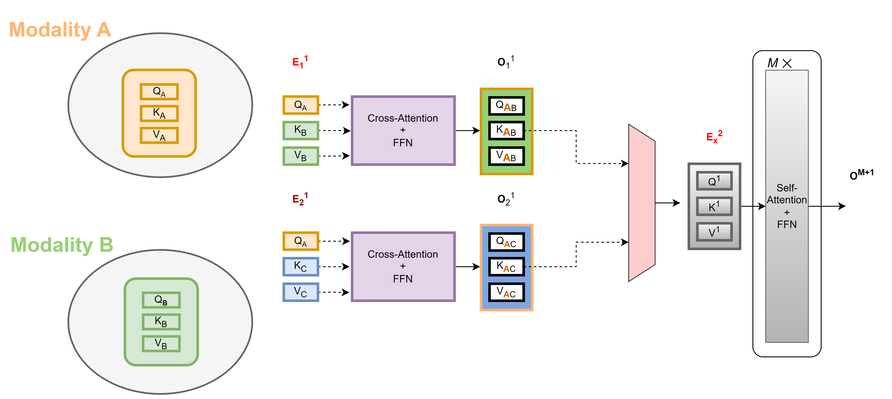

# Overview

Many current machine learning (ML) models remain narrowly focused on a single data modality, which limits the ML models’ ability to make decisions from a holistic perspective. An added layer of complexity arises from the prevalent issue of data completeness. There is frequent occurence of missing modalities in healthcare data, introducing inconsistencies across patient datasets. For instance, different data modalities may be collected for different patients. Such disparities pose significant challenges for both ML and statistical analysis. To truly harness the vast potential of heterogeneous data, we develop advanced ML models that can semlessly integrate multiple data sources, addressing the challenges posed by missing modalities. We develop an attention neural network-based method for fusing heterogeneous healthcare data, emphasizing cross-modality attention transformer blocks for optimal modality integration. Moreover, we also integrate prompt learning to enhance the model's performance with datasets that have missing modalities, preserving the core structure of the model and optimizing computational resources.  

### Two modality Example of cross-attention in 1st stage then fusion and self-attention

## **Note**: _Please see AIHC.pdf Poster for more information_ [Click here to view Poster](./AIHC.pdf)
